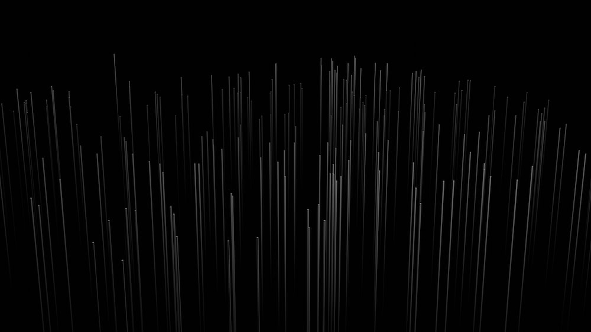

# My Super Nice Markdown Page


<link rel="stylesheet" type="text/css" href="style.css">
<script src="https://cdnjs.cloudflare.com/ajax/libs/prism/1.24.1/prism.min.js"></script>
<link rel="stylesheet" href="https://cdnjs.cloudflare.com/ajax/libs/prism/1.24.1/themes/prism.min.css" />

<script>
  Prism.highlightAll();
</script>


<div class="dropdown">
  <button onclick="myFunction()" class="dropbtn">Dropdown</button>
  <div id="myDropdown" class="dropdown-content">
    <a href="#">Link 1</a>
    <a href="#">Link 2</a>
    <a href="#">Link 3</a>
  </div>
</div>


## About Me

Hi, my name is Aadam Hitchens


<button onclick="changeBackgroundColor()">Change Background Color</button>


## My Skills

- Programming languages: 
  - C#
  - Java
  - Python
- Web development:
  - HTML/CSS
  - JavaScript
  - php

## My Projects

### Project 1: My Awesome Project

> "This project is the best thing I've ever created." - Person

> 

Here's some code that shows how I built this project:


  
```java
public static void main(String[] args)
    System.out.println("Hello, world!")
```
 

